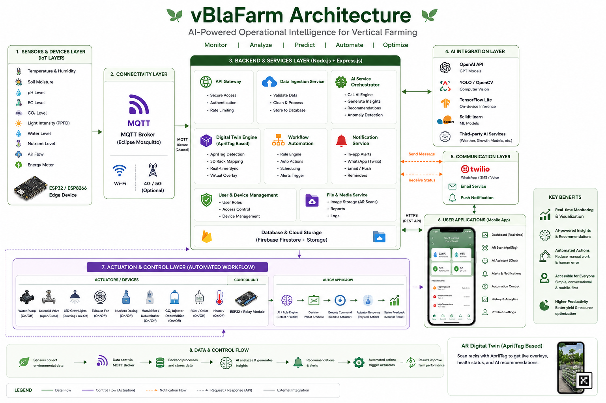

# vBlaFarm — Vertical Farming Intelligence

<div align="center">
  <h3>AI-powered operational intelligence for indoor vertical farming.</h3>
</div>

---
**Case Study 1**: Vertical Farming

**Team Name:** blablabla  
**Live Demo:** [https://blablabla-2-0.vercel.app/](https://blablabla-2-0.vercel.app/)

---

## 📖 Overview

**vBlaFarm** is an advanced operational intelligence prototype designed specifically for modern indoor vertical farming. It transforms how farm operators monitor, analyze, and optimize crop yields through a seamless blend of IoT integrations, Artificial Intelligence, and Augmented Reality (AR).

By turning raw farm data into actionable insights, vBlaFarm allows farmers to preemptively tackle environmental imbalances, visualize plant health, and ensure optimal growth conditions without breaking a sweat.

## ✨ Key Features

- **📲 AR Scan & Operational Inspection:** A premium, AI-assisted operational inspection tool. It uses a "fake AR" environment with immersive background visuals, floating operational metric cards, and a sophisticated Digital Twin insight flow that contrasts real-time sensor data with AI-predicted optimal states.
- **🌱 Digital Twin Dashboard:** Explore simulated replicas of physical farming environments. Monitor key metrics—like temperature, humidity, light intensity, and nutrient levels—in real-time.
- **🤖 AI-Powered Chatbot:** Context-aware, intelligent assistant designed to help farmers troubleshoot issues, query farm metrics, and fetch actionable advice instantly.
- **📊 Real-time Dashboard & Analytics:** Comprehensive overview screens using interactive charts (powered by `fl_chart`) to visualize historical data and predict trends.
- **🔔 Smart Alerts & Notifications:** Stay ahead of critical anomalies with timely alerts regarding suboptimal farming conditions.
- **📱 WhatsApp Integration Demo:** Showcase seamless remote monitoring notifications directly to external messaging channels.

## 🛠 Tech Stack

The application is built with modern, scalable, and cross-platform technologies:

- **Framework:** [Flutter](https://flutter.dev/)
- **State Management:** [Riverpod](https://riverpod.dev/) (`flutter_riverpod`, `riverpod_annotation`)
- **Routing:** [GoRouter](https://pub.dev/packages/go_router)
- **Local Storage:** [Hive](https://pub.dev/packages/hive) for rapid, offline-first data caching
- **Data Visualization:** [FL Chart](https://pub.dev/packages/fl_chart)
- **Camera/AR:** `camera`, `image_picker`
- **UI/UX:** `google_fonts`, `lottie`, `shimmer`, `cupertino_icons`

## 🏗 Architecture

The system utilizes a clean, feature-based architecture (e.g., `auth`, `dashboard`, `ar_scan`, `digital_twin`, `chatbot`, etc.) designed for rapid iteration and maintainability.



## 🚀 Getting Started

### Prerequisites
- [Flutter SDK](https://docs.flutter.dev/get-started/install) (`^3.7.2` or later)
- Android Studio / Xcode for emulators
- VS Code or your preferred IDE

### Installation

1. **Clone the repository:**
   ```bash
   git clone https://github.com/Jiaxin061/blablabla_2.0.git
   cd blablabla_2.0
   ```

2. **Install dependencies:**
   ```bash
   flutter pub get
   ```

3. **Run the application:**
   ```bash
   flutter run
   ```

## 🤝 Team
Built with ❤️ by team **blablabla**.
<ul>
  <li>Yap Jia Xin</li>
  <li>Karen Voon Xiu Wen</li>
  <li>Chang Wei Lam</li>
  <li>Ng Jin En</li>
  <li>Lim En Dhong</li>
</ul>
